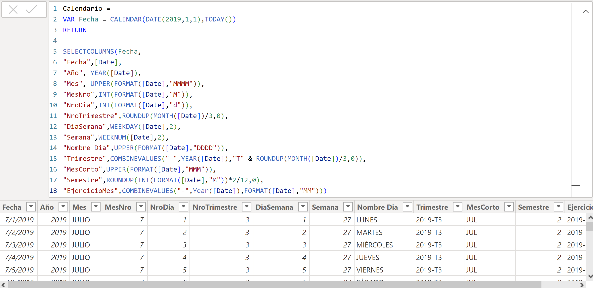
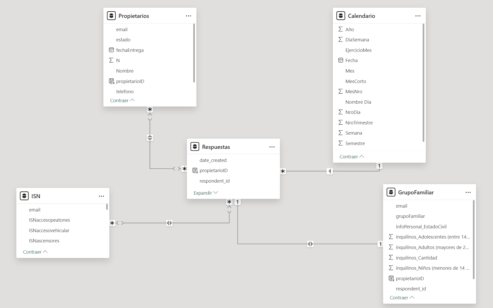
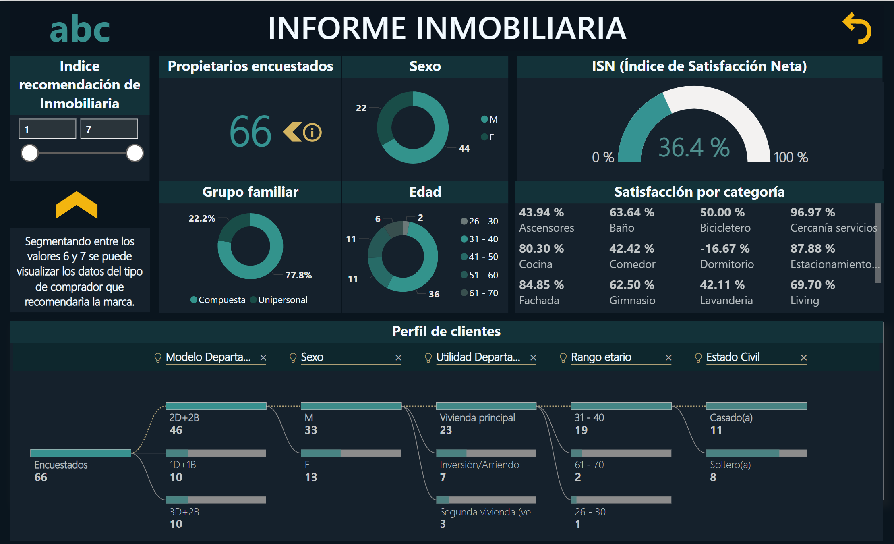
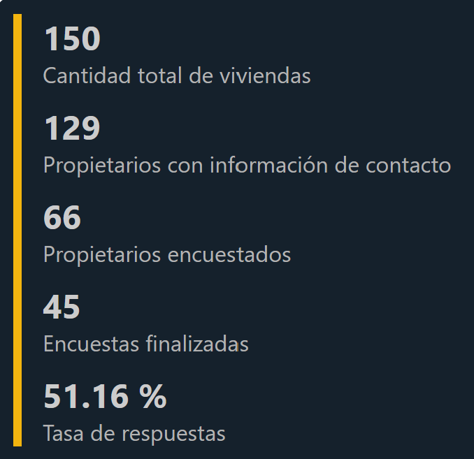

# Customer-Segmentation-for-Real-Estate

---
 

## Introduction
This project was developed as part of a trial for a recruitment process four years ago. It focused on analyzing customer data for a real estate development, which had 150 apartments. The primary objective was to classify different types of buyers, understand their interests and demographic data, and analyze customer satisfaction through survey results. Thanks to the insights generated from this analysis and the interactive Power BI report, I was selected from 115 candidates to advance to the next stage of the recruitment process.

## Problem Statement
The main objective in the report is to identify key buyer indicators, including demographic profiles, purchasing preferences, and satisfaction levels. The challenge is to gain meaningful insights from survey data, with the goal of classifying customers into different segments. Additionally, the company wanted to evaluate how satisfaction scores across various categories impacted through customer perceptions.

## Skills/Concepts demostrated
The following Power BI report features are incorporated:
- DAX
- Modelling
- Filters
- Tooltips
- Button
- Data visualization

An example of the use of DAX language is the creation of the _Calendar table_

## Modelling

The model is a star schema. There are 3 dimension tables, 1 calendar table and 1 fact table. The dimension and calendar tables are all joined to the fact table with different type of unions.

## Visualization
The report consists in 1 page and 1 tooltip, the page name is *report*.

The *tooltip* shows information about the owners surveyed and the percentage of response in the total survey. It appears when you plave the cursor over the information button.

## Analysis

Over 66 surveyed owners (51,16% of total owners), we can say that:
- Out of 66 owners contacted, 66,7% are man and 33,3% are woman.
- Most owners fall between 31–40 years old, with fewer participants in older age groups.
- 77.8% are unipersonal households, with 22.2% being multi-persons.
- The general satisfaction index sits at 36.4%, being the _Room_ the most relevant thing for improvement in overall customer contentment.
- The highest satisfaction rates are related to _services_ (96.97%), _Parking_ (87.88%), and _Facade_ (84.85%).
- Areas with lower satisfaction and that must be reviewed include the _Laundry room_ (42.11%), _Dormitory_ (-16.67%), and _Bicycle storage_ (50%).
- Apartments are mainly used as a primary residence (23 owners).
- Most respondents live in 2-bedroom, 2-bathroom apartments (46).

## Conclusion
The slider highlights that customers who rated between 6 and 7 on the recommendation index would be the *Customer persona* of the company. The main reasons of this conclusion is that those customers have aproximately 81% of net satisfaction and in the most of the cases will recommend the brand and company to other persons.
The Customer Persona for the company are persons that match with the next features:
- Mostly married people.
- People aged 31 to 40 years old generally.
- With a compound family, generally not a single-person family
- With a tendency to be a male sex (60% aproximately).

